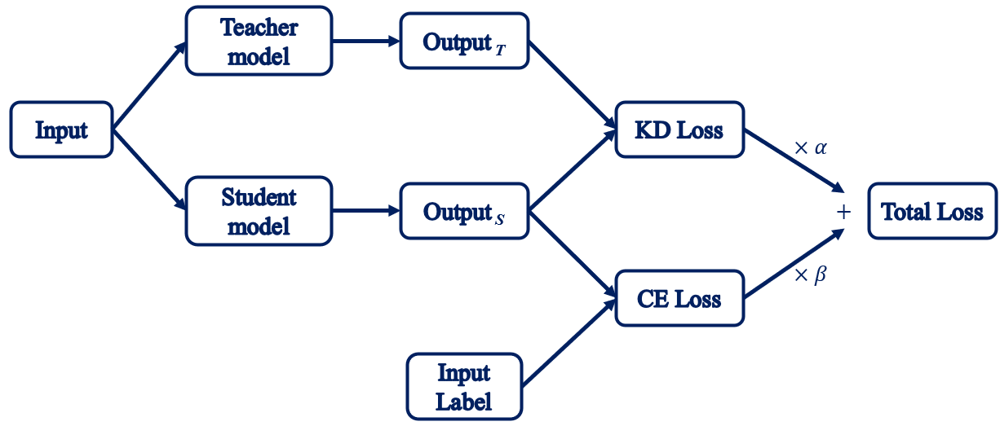

# Distillation
## Introduction
Knowledge distillation is one of popular approaches of network compression, which transfers knowledge from a large model to a smaller one without loss of validity. As smaller models are less expensive to evaluate, they can be deployed on less powerful hardware (such as a mobile device). Graph shown below is the workflow of the distillation, the teacher model will take the same input that feed into the student model to produce the output that contains knowledge of the teacher model to instruct the student model.
<br>

<br>

## usage
### script:
```python
from nlp_toolkit import metric, objectives, DistillationConfig, Criterion
from nlp_toolkit.optimization.trainer import NLPTrainer
# Replace transformers.Trainer with NLPTrainer
# trainer = transformers.Trainer(......)
trainer = NLPTrainer(......)
metric = metrics.Metric(name="eval_accuracy")
d_conf = DistillationConfig(metrics=tune_metric)
model = trainer.distill(
    distillation_config=d_conf, teacher_model=teacher_model
)
```

Please refer to [example](../examples/optimize/pytorch/huggingface/text-classification/distillation/run_glue.py) for the details.

### Create an instance of Metric
The Metric define which metric will used to measure the performance of tuned models.
- example:
    ```python
    metric = metrics.Metric(name="eval_accuracy")
    ```

    Please refer to [metrics document](metrics.md) for the details.

### Create an instance of Criterion(Optional)
The criterion used in training phase.

- arguments:
    |Argument   |Type       |Description                                        |Default value    |
    |:----------|:----------|:-----------------------------------------------|:----------------|
    |name       |String|Name of criterion, like:"KnowledgeLoss", "IntermediateLayersLoss"  |"KnowledgeLoss"|
    |temperature|Float |parameter for KnowledgeDistillationLoss               |1.0             |
    |loss_types|List of string|Type of loss                               |['CE', 'CE']        |
    |loss_weight_ratio|List of float|weight ratio of loss                 |[0.5, 0.5]     |
    |layer_mappings|List|parameter for IntermediateLayersLoss             |[] |
    |add_origin_loss|bool|parameter for IntermediateLayersLoss            |False |

- example:
    ```python
    criterion = Criterion(name='KnowledgeLoss')
    ```

### Create an instance of DistillationConfig
The DistillationConfig contains all the information related to the model distillation behavior. If you created Metric and Criterion instance, then you can create an instance of DistillationConfig. Metric and pruner_config is optional.

- arguments:
    |Argument   |Type       |Description                                        |Default value    |
    |:----------|:----------|:-----------------------------------------------|:----------------|
    |framework  |string     |which framework you used                        |"pytorch"        |
    |criterion|Criterion |criterion of training                              |"KnowledgeLoss"|
    |metrics    |Metric    |Used to evaluate accuracy of tuning model, no need for NoTrainerOptimizer|None    |

- example:
    ```python
    d_conf = DistillationConfig(metrics=metric, criterion=criterion)
    ```

### Distill with Trainer
- Distill with Trainer
    NLPTrainer inherits from transformers.Trainer, so you can create trainer like you do in transformers examples. Then you can distill model with trainer.distill function.
    ```python
    model = trainer.distill(
        distillation_config=d_conf, teacher_model=teacher_model
    )
    ```
