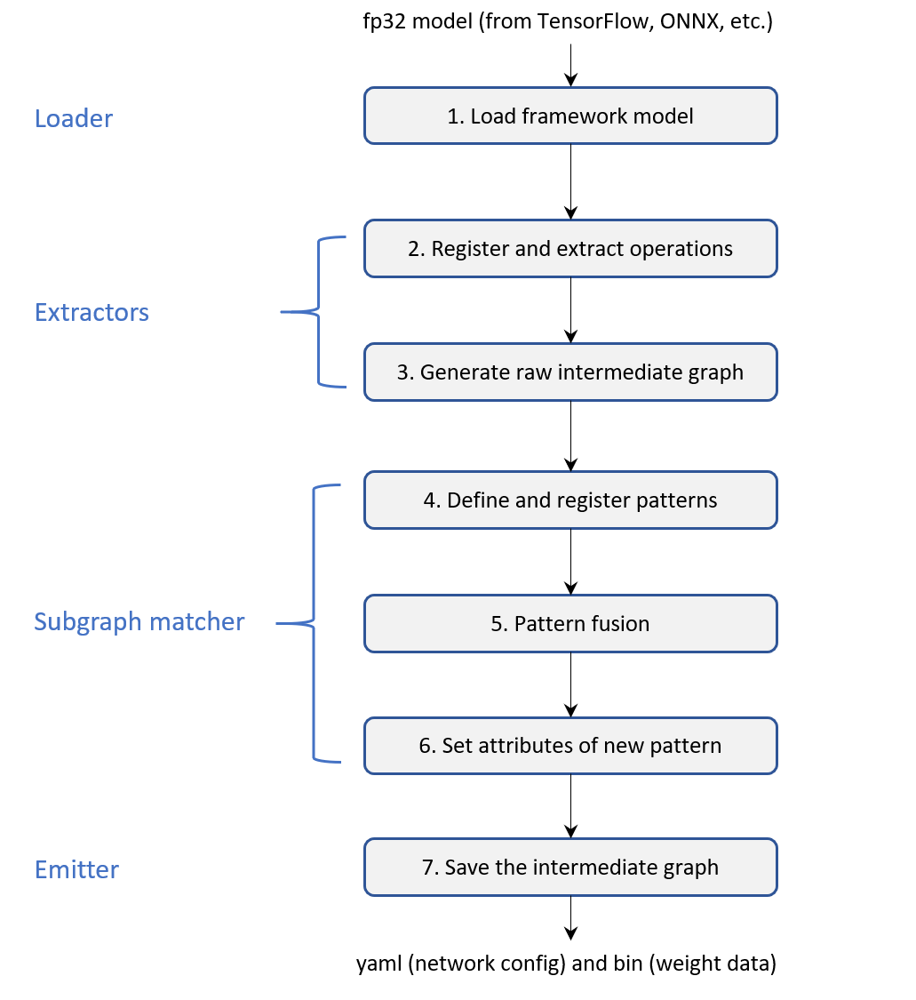
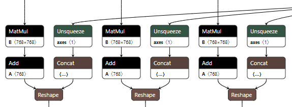
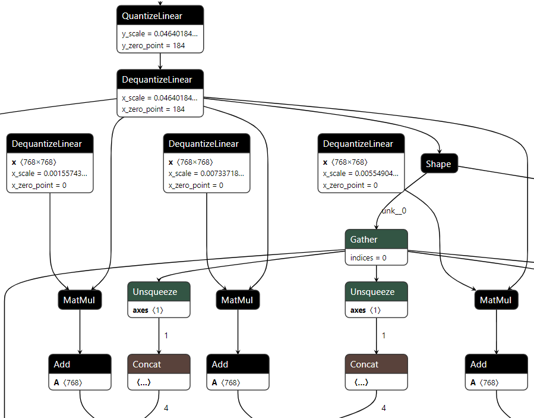
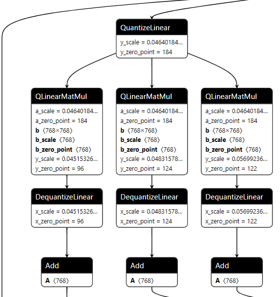

# Compile an ONNX Model to Engine IR

## Introduction

The Neural Engine as a backend supports frozen static graph models from ONNX deep learning framework. The image below shows the workflow of how it compiles framework model to its own intermediate representation (IR). The `Loader` is used to load models from different frameworks. Then the `Extractors` would extract operations of the original model and compose the Neural Engine graph. Next, the `Subgraph matcher` fuse pattern to accelerate inference. In the end, the `Emitter` saves the final intermediate graph on the disk as the format of `.yaml` and `.bin` files.



## ONNX format supported by compile module
Neural Engine could compile several ONNX format models like fp32, bf16, int8(qlinear/qdq). Here are the respective QKV MatMul graphs opened by netron.  
Notice: As for int8 model, Neural Engine only supports int8 matmul with s8 weight and u8 activation now. And we will support more int8 operators in the future.  

And We will support more operators in the features. The fp32 and bf16 models use the same graph, just different in data type of tensors.  


The qdq model will insert QuantizeLinear and DequantizeLinear before int8 operator. You can see there's QuantizeLinear and DequantizeLinear before matmul.  


The qdq model will insert QuantizeLinear before int8 operator and modify MatMul to QLinearMatMul. If you want to get fp32 output and you also need to insert DequantizeLinear. You can see there are QuantizeLinear before QLinearMatMul and DequantizeLinear after it.  


## How to use
Here is the example [distilbert_base_mrpc](../../../../examples/deployment/neural_engine/mrpc/distilbert_base_uncased) to show how to compile ONNX model to Neural Engine IR.

### 1.Prepare model

We have prepared a script to get the model from [Hugging Face](https://huggingface.co/) and exported it following steps in example README.md. You can get FP32 ONNX model from optimization module by setting precision=fp32. The command is as follows:
```shell
bash prepare_model.sh --input_model=textattack/distilbert-base-uncased-MRPC  --task_name=mrpc --output_dir=./model_and_tokenizer --precision=fp32
```
And by setting precision=int8/bf16, you could get int8(PTQ, qdq)/bf16 onnx model.
```shell
bash prepare_model.sh --input_model=textattack/distilbert-base-uncased-MRPC  --task_name=mrpc --output_dir=./model_and_tokenizer --precision=int8
bash prepare_model.sh --input_model=textattack/distilbert-base-uncased-MRPC  --task_name=mrpc --output_dir=./model_and_tokenizer --precision=bf16
```
After that, you can get the <fp32/bf16/int8>-model.onnx under model_and_tokenizer folder.

### 2.Compile model to Nerual Engine IR

Compiling a model to IR is much easy. You just use compile API in python as follows and IR will be stored in the specified directory path like the following fp32 model example.
```python
# import compile api from neural engine
from nlp_toolkit.backends.neural_engine.compile import compile
# compile onnx model to neural engine ir
graph = compile("./model_and_tokenizer/fp32-model.onnx")
# save the graph and get the final ir
# the yaml and bin file will stored in <ir_path> folder
graph.save('ir_path')
```
